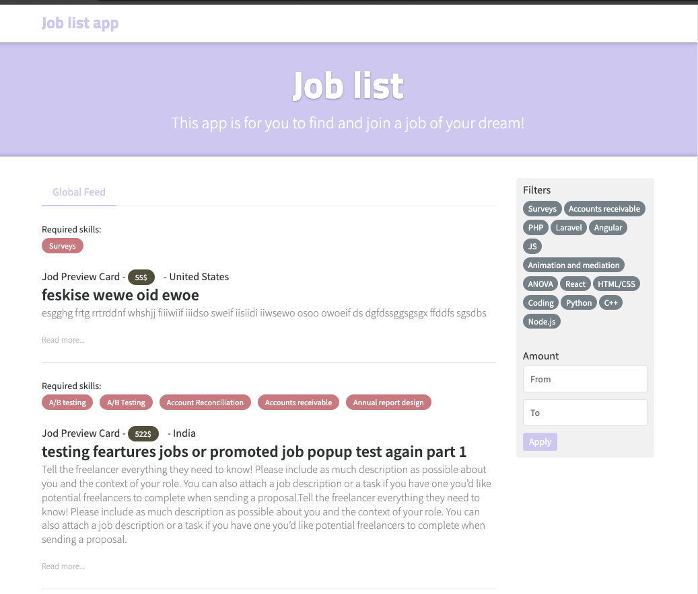

  <h1 align="center">Job app 🍰 Feature-Sliced Design</h1>

  

    This is test project to demonstrate the <a href="https://feature-sliced.design">Feature-Sliced Design</a> approach. And use new stack of technologies.
  

  

# Getting started

This project was bootstrapped with [Create Vite](https://vitejs.dev/guide/#getting-started)

To get the frontend running locally:

1. Clone this repo
2. `yarn install` to install all the dependencies defined in a `package.json` file.
3. `yarn dev` to start Vite dev server.

# Scripts

- `yarn dev` - start a development server with hot reload.
- `yarn build` - start build.
- `yarn test` - start tests.

 

[![Feature-Sliced Design][shields-fsd-domain]](https://feature-sliced.design/)
[![Vite][shields-vite-domain]](https://vitejs.dev/)
[![React][shields-react-domain]](https://react.dev/)
[![React Router][shields-react-router-domain]](https://reactrouter.com/)
[![React Query][shields-react-query-domain]](https://tanstack.com/query/v4/)
[![Zustand][shields-zustand-domain]](https://zustand-demo.pmnd.rs/)
[![TypeScript][shields-typescript-domain]](https://www.typescriptlang.org/)